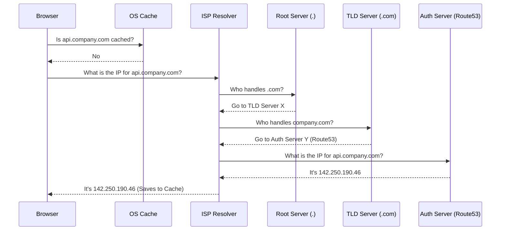
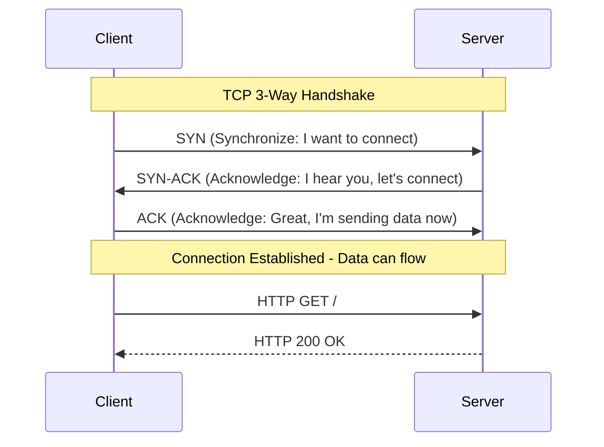

# Day 1: How the Internet Actually Works (DNS, TCP/IP, Packets)

## 1. Why Important (What Problem This Solves)
When you deploy a backend application to production and it suddenly goes offline, how do you debug it? If you don't understand how the internet works, you'll be blindly restarting servers. Understanding DNS, TCP/IP, and ports is what separates coders who copy-paste Express tutorials from actual Backend Engineers who can diagnose firewall rules, DNS propagation issues, and port binding conflicts. 

> [!IMPORTANT]  
> The first step to debugging a down server is almost always checking DNS and Network Layers before touching the application code.

## 2. Beginner-Friendly Explanation
Think of the internet like the global postal system:
*   **IP Address**: The exact street address of a building (your server).
*   **Port**: The specific apartment number inside that building (e.g., Port 80 for HTTP, Port 5432 for Postgres).
*   **DNS (Domain Name System)**: The phonebook. You don't memorize IP addresses like `142.250.190.46`; you memorize `google.com`. DNS translates the name to the address.
*   **TCP**: The registered mail service. It guarantees that if a packet gets lost in transit, it will be resent. 

## 3. Industry-Level Deep Explanation
In production, we operate on the **TCP/IP Model**:

| Layer | Protocols | What it does |
| :--- | :--- | :--- |
| **Application** | HTTP, HTTPS, SSH, WebSockets | Where you write your code. Deals with API payloads. |
| **Transport** | TCP, UDP | Determines *how* data is delivered (Reliable vs Fast). |
| **Network** | IP, ICMP (Ping) | Routes packets across different routers on the internet. |

## 4. How It Works Internally

### Flow 1: The DNS Lookup
When a user hits `api.yourcompany.com`, the browser must find the IP address.

### Flow 2: TCP 3-Way Handshake
Before sending any HTTP data, your laptop and the server establish a reliable connection.

## 5. Real Project Usage
Whenever you buy a domain name and connect it to AWS, Vercel, or Heroku, you are configuring DNS records (A Records point to IPv4 addresses, CNAMEs point to other domains). When you configure cloud firewalls (Security Groups), you allow TCP traffic on specific ports (like 443 for HTTPS).

## 6. Common Mistakes Juniors Make
> [!WARNING]  
> **Binding to `localhost` vs `0.0.0.0`**: Juniors often run their Node app on `localhost:3000` inside a Docker container or EC2, and wonder why the outside world can't access it. 
> *   `localhost` (`127.0.0.1`) = **ONLY** accept traffic from inside this exact machine.
> *   `0.0.0.0` = Accept traffic from **ANY** IP on the network.

## 7. Senior Developer Best Practices
*   **Low TTL for Migrations**: Before moving to a new server IP, lower the DNS TTL (Time To Live) to 60 seconds a day in advance. If the migration fails, rolling back the IP takes 1 minute instead of 24 hours.
*   **Never Expose Databases**: Your Node.js app runs on a public port (`443`), but your database port (`5432`) must be heavily firewalled and ONLY accessible by your backend's internal network IP.

## 8. Interview Questions

**Beginner:**
* What is the difference between an IP address and a MAC address?
* What port does HTTP run on? What about HTTPS?

**Intermediate:**
* What is the difference between TCP and UDP? Give an example of when to use each.
* Explain what localhost / `127.0.0.1` is.

**Senior:**
* Walk me through exactly what happens when you type `https://www.google.com` into your browser and press Enter.

**HR / Behavioral:**
* Tell me about a time an application went down in production and how you diagnosed the root cause.

## 9. Real Company Insight
> [!NOTE]  
> *"It's always DNS."* Whenever a microservice can't talk to another microservice, or an API is down but the code is perfect... it's usually a misconfigured DNS record or a firewall blocking a port.
