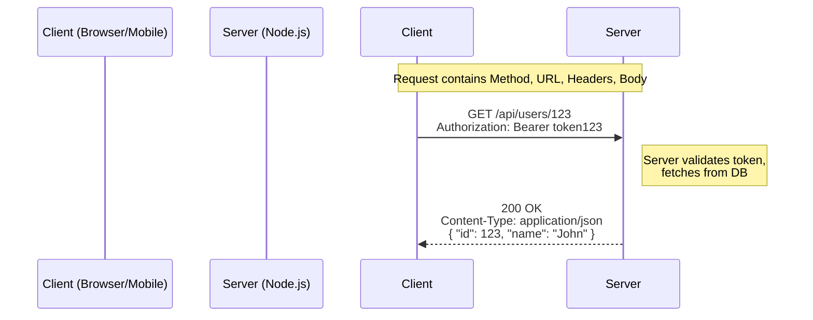
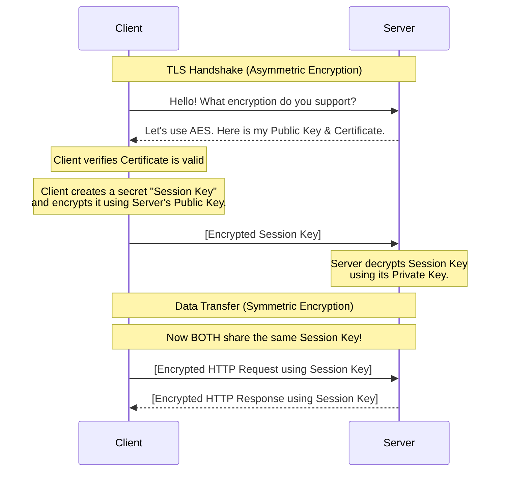

# Day 2: HTTP / HTTPS Deep Dive

## 1. Why Important (What Problem This Solves)
Every web API you ever build will communicate over HTTP. If you don't understand HTTP deeply, your APIs will be brittle, unscalable, and insecure. Knowing the exact difference between `PUT` and `PATCH`, how to use headers for caching and authentication, and what status codes actually mean is the difference between a sloppy API and a professional, production-grade service.

## 2. Beginner-Friendly Explanation
HTTP (Hypertext Transfer Protocol) is the language the browser and server use to talk to each other. 
*   **Request**: The client asks for something. ("Give me user #123").
*   **Response**: The server replies. ("Here is user #123", or "You are not authorized").
*   **HTTPS**: The exact same thing, but the conversation is encrypted in an unbreakable vault.

## 3. Industry-Level Deep Explanation
> [!IMPORTANT]  
> HTTP is a **stateless** protocol. The server has amnesia; it forgets who you are the millisecond the response is sent. Every single request must contain all the information necessary for the server to understand it (like an Auth token).

### The HTTP Request/Response Cycle

## 4. How It Works Internally: HTTPS & TLS
HTTPS uses TLS (Transport Layer Security) to encrypt data. It uses a mix of Asymmetric (Public/Private key) and Symmetric encryption.

## 5. HTTP Methods & Idempotency

> [!TIP]  
> **Idempotency**: Executing the request 1 time or 100 times has the exact same result on the server's state.

| Method | Purpose | Idempotent? | Example |
| :--- | :--- | :--- | :--- |
| `GET` | Read data | ✅ Yes | Fetching a profile |
| `POST` | Create data | ❌ No | Charging a credit card, creating user |
| `PUT` | Replace entire object | ✅ Yes | Overwriting an entire profile |
| `PATCH`| Partially update object| ❌ No (usually) | Updating just the `age` field |
| `DELETE`| Remove data | ✅ Yes | Deleting a post |

## 6. HTTP Status Codes Cheat Sheet

| Code Range | Meaning | Common Examples |
| :--- | :--- | :--- |
| **2xx** | Success | `200 OK`, `201 Created` (used with POST), `204 No Content` |
| **3xx** | Redirection | `301 Moved Permanently`, `302 Found` |
| **4xx** | Client Error (Your fault) | `400 Bad Request`, `401 Unauthorized` (needs login), `403 Forbidden` (no permission), `404 Not Found` |
| **5xx** | Server Error (My fault) | `500 Internal Server Error`, `502 Bad Gateway`, `503 Service Unavailable` |

## 7. Common Mistakes Juniors Make
> [!WARNING]  
> **The "200 OK" Error**: Returning a `200 OK` status code but sending `{ "error": "User not found" }` in the JSON body. If it's an error, the status code *must* reflect it (e.g., `404`).
>
> **Sensitive Data in GET**: Passing passwords or API keys in the URL query string (`/login?password=secret123`). URLs are logged in server logs and browser history. Always use `POST` for sensitive data.

## 8. Interview Questions

**Beginner:**
*   What is the difference between `GET` and `POST`?
*   Name the 4 main families of HTTP Status Codes.

**Intermediate:**
*   What is the difference between `PUT` and `PATCH`? 
*   What does it mean that HTTP is stateless?

**Senior:**
*   Explain the concept of Idempotency in REST APIs. Which methods are idempotent?
*   Explain the TLS handshake step-by-step. How does HTTPS prevent Man-in-the-Middle attacks?
